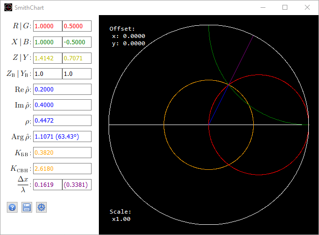

# SmithChart

Interactive Smith Chart. Allows to calculate:
  * impedance `Z=R+jX` and admittance `Y=G+jB` given: reflection coefficient `ρ` or ((traveling wave coefficient `TWC` or standing wave ratio `SWR`) and ratio `Δx/λ`)
  * reflection coefficient `ρ`, traveling wave coefficient `TWC`, standing wave ratio `SWR` and ratio `Δx/λ` given: impedance `Z=R+jX` or admittance `Y=G+jB`
and also displays the obtained point on the Smith chart. The point on the Smith chart can be selected manually with the mouse, then all values ​​​​will be automatically recalculated.

## Usage
  * Mouse movement with the left button pressed --- build of circles of constant active `R` and reactive `X` resistances passing through a given point lying on a circle of radius equal to the modulus of the reflection coefficient `ρ`.
  * Mouse movement with the right button pressed --- shift relative to the point `ρ = 0`.
  * Mouse wheel --- change the scale in steps of `25%`.
  * SHIFT --- fixes the value by `y`, i.e. `im(ρ)`.
  * CTRL --- fixes the value by `x`, i.e. `re(ρ)`.
  * ALT --- fixes the value on the circle equal to TWC(SWR), i.e. `ρ`.
The calculation of the values ​​of the sought quantities is performed by pressing `<Enter>` in the input field of the specified value.
When entering non-standard values ​​`R`, `X`, `G` and `B`, it is necessary to enter the value `Zw` or `Yw` in the corresponding field.
Left-clicking the screenshot button will save a screenshot of only the chart area, right-clicking will save a screenshot of the entire window.